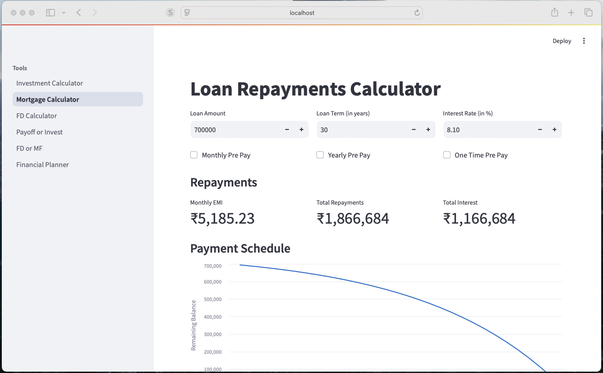
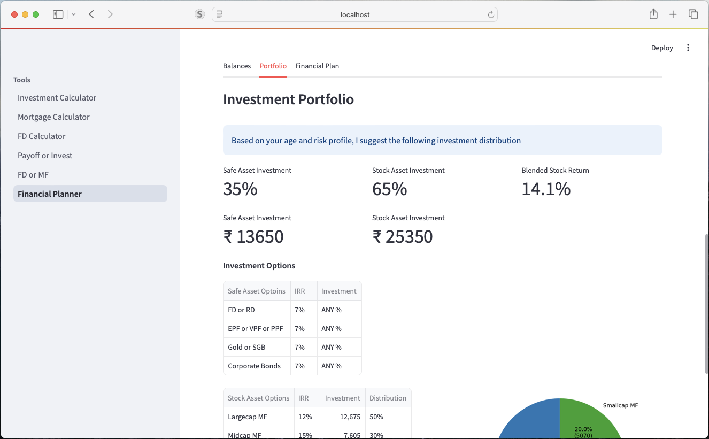

# Financial Planner (for INDIAN citizens 🇮🇳)

**Note**: I am not a financial advisor. This project is inspired by multiple financial advisors and their calculators.

## Overview
Welcome to the Financial Planner! This repository contains a suite of financial tools developed in pure Python, designed to help you make informed financial decisions. Whether you're planning for retirement, managing your mortgage, or deciding between different investment options, these tools have got you covered.

 

## Tools
### Investment Calculator
The Investment Calculator provides a glimpse of potential returns you can achieve after retirement by making investments in various categories. It helps you compare different investment options and choose the one that aligns best with your financial goals.

### Mortgage Calculator
The Mortgage Calculator is a simple loan repayment calculator that includes monthly, yearly, and one-time prepayment calculations. It gives you a clear picture of how much you can save by making prepayments on your loan, helping you manage your debt more efficiently.

### FD Calculator
The FD (Fixed Deposit) Calculator not only computes the interest earned on your fixed deposit but also includes TDS (Tax Deducted at Source) and other tax implications. This tool helps you understand the true value of your FD investments after accounting for taxes.

### Payoff the Loan or Invest
This tool helps you decide whether to use your available funds to pay off an existing loan or to invest the money for greater returns. It provides a comparative analysis to aid you in making the best financial decision based on your circumstances.

### Invest in FD or Mutual Funds
Unsure whether to invest your lump sum in a Fixed Deposit or Mutual Funds? This tool helps you providing a clear comparison to guide your investment decisions.

### Financial Planner
The Financial Planner is your complete guide to financial planning. It integrates all the tools mentioned above to provide you with a comprehensive financial strategy, helping you achieve your long-term financial goals.


## Getting Started
To get started with the Financial Planner tools, follow these steps:

1. Clone the repository
    ```bash
    git clone https://github.com/DineshReddyK/financial-planner.git
    cd financial-planner
    ```

2. Install the required dependencies:
    ```bash
    pip install -r requirements.txt
    ```
3. Run the main
    ```bash
    streamlit run home.py
    ```

### Contributing
Contributions are welcome! If you have any suggestions or improvements, please submit a pull request or open an issue. Let's work together to make financial planning accessible to everyone.


### Disclaimer
The Financial Planner tools are for informational purposes only and do not constitute financial advice. Please consult with a professional financial advisor before making any financial decisions.
