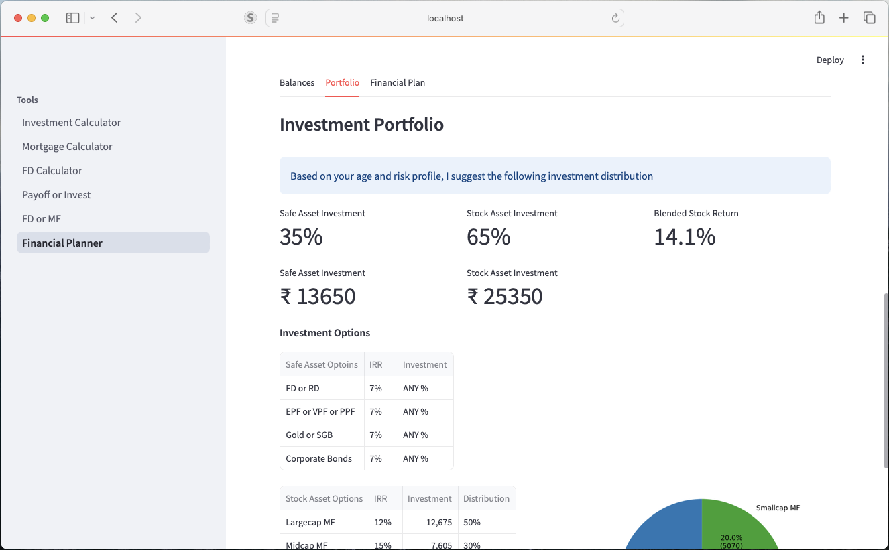

# Financial Planner (India)

**Disclaimer:** For education only — not financial, tax, or legal advice. Tax slabs and instrument rules are simplified; confirm with a CA or RBI/IT notifications.

## What this is

A **Python** toolkit for back-of-the-envelope planning:

- Shared math in [`planner_core/`](planner_core/) (`services.py` + `extended.py`)
- **FastAPI** + Jinja + Tailwind UI: [`web/`](web/) (OpenAPI at `/docs`)

  
*(Add your screenshot under `assets/` if the file is missing.)*

---

## Calculators (web)

| Tool | What it does |
|------|----------------|
| Investment calculator | Step-up SIP scenarios; inflation-adjusted “today’s money” |
| Mortgage | EMI, prepayments, interest saved vs no-prepay baseline |
| FD | Monthly compounding; **slab tax**; TDS shown as info (not double-counted) |
| Payoff or invest | Remaining loan interest vs lump + SIP FV (heuristic) |
| FD or MF | FD vs liquid MF vs savings, after tax |
| SIP goal planner | Target → required constant SIP; FV with yearly step-up |
| Emergency fund | Target corpus from months of expenses; months to close gap |
| Rent vs buy | Month-level toy model: terminal net worth renter vs buyer |
| EPF · NPS · PPF | Coarse projections (not employer-specific rules) |
| Debt payoff | Credit card months-to-clear vs personal-loan EMI |
| Senior TDS · SWP · Real return | Interest TDS threshold note, Fisher real return, SWP runway |
| Education / wedding goal | Inflate goal cost, then SIP |
| Monte Carlo | Lognormal monthly returns; median & p10–p90 |

**JSON API (examples):** `POST /api/investment`, `/api/mortgage`, `/api/fd`, `/api/sip-goal`, `/api/emergency-fund`, `/api/monte-carlo` — see **`/docs`**.

---

## Quick start (local)

```bash
git clone https://github.com/DineshReddyK/financial-planner.git
cd financial-planner
./scripts/deploy.sh install
./scripts/deploy.sh dev-web     # http://127.0.0.1:8080  (auto-reload)
```

Manual equivalent:

```bash
python3 -m venv .venv && .venv/bin/pip install -r requirements.txt
.venv/bin/uvicorn web.main:app --app-dir . --host 0.0.0.0 --port 8080 --reload
```

Environment knobs (optional): copy `.env.example` → `.env` for `docker-compose` port overrides.

---

## Deploy on Render (free tier)

Repo includes [`render.yaml`](render.yaml) (Docker web service) and a Dockerfile that listens on **`PORT`** (Render sets this automatically).

1. Push this repo to **GitHub** (or GitLab — Render supports both).
2. Sign up at [render.com](https://render.com) and link your Git provider.
3. **New** → **Blueprint** → pick this repository → Render reads `render.yaml`.
4. Confirm the service (name **financial-planner**, **Free** plan) and **Apply**.

First deploy builds the image (a few minutes). Your app URL will look like `https://financial-planner-xxxx.onrender.com`.

**Free tier notes:** The instance **spins down after ~15 minutes idle**; the next visit can take **30–60s** to wake. Chart.js / Tailwind load from CDNs; no extra Render config needed.

To deploy **without** Blueprint: **New** → **Web Service** → connect repo → **Environment** `Docker` → Dockerfile path `./Dockerfile` → create.

---

## Deploy (Docker)

```bash
./scripts/deploy.sh docker-build
./scripts/deploy.sh docker-web          # maps host $PORT_WEB → 8080

./scripts/deploy.sh compose-up          # docker compose up --build
```

The image exposes **8080** (FastAPI).

Production checklist (you still own this):

- Put TLS/reverse proxy (Caddy, nginx, Traefik) in front
- Pin dependency versions for reproducible builds
- Do not commit `.env`

---

## Repository layout

```
planner_core/     # Pure calculation functions
web/              # FastAPI app, templates, static
scripts/deploy.sh # install / run / docker helpers
```

---

## Contributing

Issues and PRs welcome — keep changes focused; extend `planner_core` first, then wire `web/main.py` and `web/routes_extended.py`.

---

## License

See [LICENSE](LICENSE).
